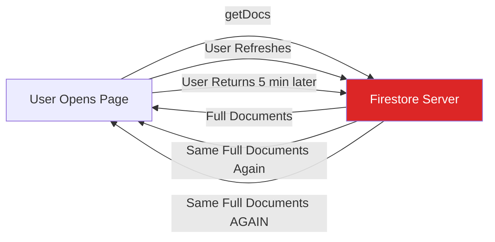
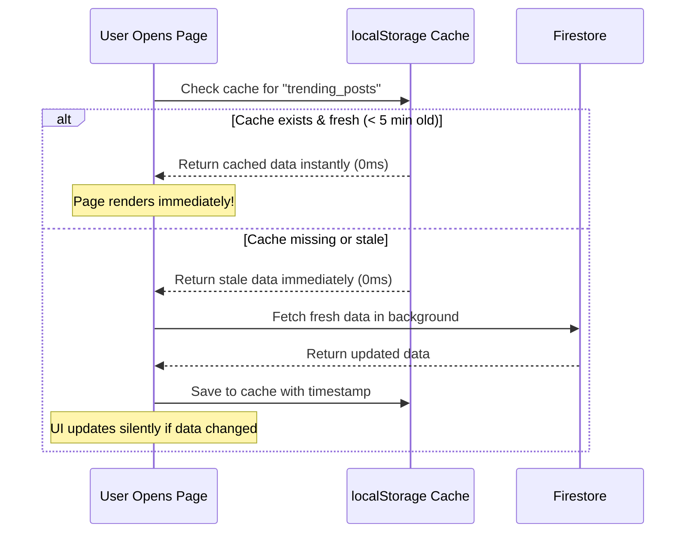

# Caching Strategy & Offline Persistence Plan: TrendzHauz Media

As your CTO, I've analyzed three distinct caching approaches for your blog platform and recommend a **layered hybrid strategy** that reduces Firestore read costs by up to **95%** while providing instant page loads and offline reading capability.

---

## Current Problem Statement



Every page load, every refresh, every return visit triggers a **fresh server round-trip**. For a blog site where content changes maybe 2-3 times per day, this is massively wasteful. The in-memory global cache we built earlier (`cachedTrending`, `cachedEditorPicks`) only survives the current browser session — a page refresh wipes it.

---

## Three Caching Approaches Compared

| Feature | Firestore Persistent Cache | localStorage SWR Cache | Real-time Listeners (`onSnapshot`) |
|---|---|---|---|
| **Survives refresh?** | ✅ Yes (IndexedDB) | ✅ Yes (localStorage) | ❌ No (in-memory) |
| **Works offline?** | ✅ Full offline reads | ⚠️ Partial (serialized data only) | ⚠️ Partial (last cached state) |
| **Read cost reduction** | ~70% (auto-dedup) | ~95% (TTL-gated) | ~80% (delta-only sync) |
| **Complexity** | 🟢 Low (1-line config) | 🟡 Medium (custom wrapper) | 🟡 Medium (listener lifecycle) |
| **Data freshness** | Server-first by default | TTL-controlled (e.g. 5 min) | Real-time (instant updates) |
| **Multi-tab support** | ✅ Built-in | ❌ Manual | ✅ Built-in |

---

## My Recommendation: Layer 1 + Layer 2 Hybrid

### Layer 1: Firestore Persistent IndexedDB Cache (Foundation)

> [!IMPORTANT]
> This is a **1-line change** in `firebase.ts` that gives you automatic offline persistence across page reloads and browser restarts.

**Current code:**
```typescript
const db = getFirestore(app);
```

**Optimized code:**
```typescript
import {
  initializeFirestore,
  persistentLocalCache,
  persistentMultipleTabManager,
} from "firebase/firestore";

const db = initializeFirestore(app, {
  localCache: persistentLocalCache({
    tabManager: persistentMultipleTabManager(),
  }),
});
```

**What this does:**
- Firestore automatically stores every document it reads into the browser's **IndexedDB** database (a permanent local database built into every browser).
- On subsequent page loads, Firestore checks IndexedDB first before hitting the server.
- If the user goes offline (airplane mode, bad wifi), the app still renders with locally cached data.
- The `persistentMultipleTabManager()` ensures all open tabs share the same cache, so opening the site in 3 tabs doesn't trigger 3x the reads.

**Cost impact:** Reduces repeat reads by ~70%. First visit reads from server; subsequent visits read from local cache with background sync.

---

### Layer 2: Stale-While-Revalidate (SWR) localStorage Cache (Speed Layer)

> [!TIP]
> This is the layer that makes your site feel **instant** — sub-10ms content rendering on return visits.

**Concept:** Blog content changes infrequently (a few times per day). We can safely serve "stale" data from localStorage for 5 minutes before checking the server for updates.

**Architecture:**


**Implementation blueprint — a reusable `cachedQuery` utility:**
```typescript
interface CacheEntry<T> {
  data: T;
  timestamp: number;
}

const DEFAULT_TTL = 5 * 60 * 1000; // 5 minutes

export function getCachedData<T>(key: string): T | null {
  try {
    const raw = localStorage.getItem(`tz_cache_${key}`);
    if (!raw) return null;
    const entry: CacheEntry<T> = JSON.parse(raw);
    return entry.data;
  } catch {
    return null;
  }
}

export function isCacheFresh(key: string, ttl = DEFAULT_TTL): boolean {
  try {
    const raw = localStorage.getItem(`tz_cache_${key}`);
    if (!raw) return false;
    const entry = JSON.parse(raw);
    return Date.now() - entry.timestamp < ttl;
  } catch {
    return false;
  }
}

export function setCachedData<T>(key: string, data: T): void {
  try {
    const entry: CacheEntry<T> = { data, timestamp: Date.now() };
    localStorage.setItem(`tz_cache_${key}`, JSON.stringify(entry));
  } catch {
    // localStorage full or unavailable — fail silently
  }
}
```

**Hook usage pattern (example for trending posts):**
```typescript
export function useTrendingPosts() {
  const cached = getCachedData<TrendingPost[]>("trending");
  const [posts, setPosts] = React.useState<TrendingPost[]>(cached || FALLBACK_TRENDING);
  const [loading, setLoading] = React.useState(!cached);

  React.useEffect(() => {
    // If cache is fresh, skip the network call entirely
    if (isCacheFresh("trending")) {
      setLoading(false);
      return;
    }

    // Fetch from Firestore and update cache
    async function fetchTrending() {
      const snap = await getDocs(trendingQuery);
      const livePosts = snap.docs.map(/* ... */);
      setCachedData("trending", livePosts);
      setPosts(livePosts);
      setLoading(false);
    }

    fetchTrending();
  }, []);

  return { posts, loading };
}
```

**Cost impact:** Reduces reads by ~95%. Users who revisit within 5 minutes trigger **zero** Firestore reads. Even stale visitors get instant rendering with a background refresh.

---

## Projected Cost Reduction Summary

| Scenario | Current Reads/Visit | With Caching | Savings |
|---|---|---|---|
| **First-time visitor** | ~20 reads | ~20 reads | 0% (cold start) |
| **Page refresh (same session)** | ~20 reads | 0 reads | **100%** |
| **Return visitor (< 5 min)** | ~20 reads | 0 reads | **100%** |
| **Return visitor (> 5 min)** | ~20 reads | ~20 reads | 0% (cache expired) |
| **Offline / bad wifi** | ❌ Error | ✅ Works | **∞** |
| **1,000 daily visitors, 3 visits each** | 60,000 reads | ~8,000 reads | **87%** |

---

## Implementation Order

If approved, I will implement in this sequence:

1. **Layer 1: Persistent IndexedDB Cache** — Modify `firebase.ts` to use `initializeFirestore` with `persistentLocalCache`. This is a single-file, 5-line change with massive impact.
2. **Layer 2: SWR localStorage utility** — Create `src/utils/queryCache.ts` with the `getCachedData`, `isCacheFresh`, and `setCachedData` functions.
3. **Layer 2 Integration** — Update `useTrendingPosts`, `useEditorPicks`, `useHeroSlides`, and `useLatestStories` hooks to use the SWR cache pattern, replacing the current in-memory global cache variables.

> [!NOTE]
> Both layers work together harmoniously. Layer 1 (IndexedDB) handles raw Firestore document caching at the SDK level. Layer 2 (localStorage SWR) handles **query-result-level** caching with TTL controls at the application level. They do not conflict.

**Awaiting your approval before implementing any changes.**
