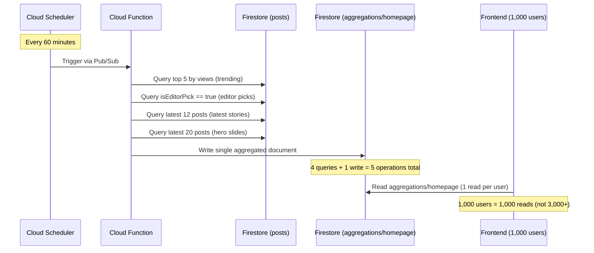

# Cloud Functions Cron Job — Technical Breakdown

## Overview

We implemented a **scheduled Google Cloud Function** that runs every 60 minutes to pre-compute the homepage's data feeds (Trending, Editor's Picks, Latest Stories, Hero Slides) and store the results in a single Firestore document. The frontend hooks now read from this one pre-aggregated document instead of running multiple independent queries per visitor.

---

## Architecture



---

## Files Created & Modified

### New Files

| File | Purpose |
|------|---------|
| `functions/package.json` | Dependencies: `firebase-admin` v13, `firebase-functions` v6, Node 22 runtime |
| `functions/tsconfig.json` | TypeScript config targeting ES2022 with CommonJS output |
| `functions/src/index.ts` | The scheduled aggregation function (`aggregateHomepageData`) |

### Modified Files

| File | Change |
|------|--------|
| `firebase.json` | Added `"functions"` config block and functions emulator port (5001) |
| `firestore.rules` | Added `aggregations/{docId}` match block: public read, no client write |
| `src/hooks/useBlogData.ts` | Updated 3 hooks to try `aggregations/homepage` first, fallback to direct queries |
| `.gitignore` | Added `functions/lib` and `functions/node_modules` |

---

## How the Cloud Function Works

### Trigger
- **Service**: Google Cloud Scheduler
- **Schedule**: `every 60 minutes`
- **Region**: `us-central1`
- **Memory**: 256 MiB
- **Timeout**: 120 seconds

### Execution Flow

The function `aggregateHomepageData` performs 4 Firestore queries in sequence:

1. **Trending Posts** — `posts` where `status == "published"`, ordered by `views desc`, `createdAt desc`, limit 5
2. **Editor's Picks** — `posts` where `status == "published"` AND `isEditorPick == true`, ordered by `createdAt desc`, limit 3
3. **Latest Stories** — `posts` where `status == "published"`, ordered by `createdAt desc`, limit 12
4. **Hero Slides** — `posts` where `status == "published"`, ordered by `createdAt desc`, limit 20 (then picks the latest post per category in-memory)

### Output Document

All results are written to **`aggregations/homepage`**:

```json
{
  "trending": [{ "rank": 1, "title": "...", "slug": "...", ... }],
  "editorPicks": [{ "category": "Reviews", "title": "...", ... }],
  "latestStories": [{ "id": "...", "title": "...", "rating": 8.7, ... }],
  "heroSlides": [{ "category": "Music", "title": "...", "image": "...", ... }],
  "lastAggregatedAt": "2026-07-20T19:00:00Z",
  "postCount": 12
}
```

---

## How the Frontend Hooks Changed

Each of the 3 sidebar hooks (`useHeroSlides`, `useTrendingPosts`, `useEditorPicks`) now follows this priority chain:

```
1. In-memory SWR cache (instant, 0 reads)
    ↓ cache miss
2. Read aggregations/homepage document (1 read)
    ↓ document missing or empty
3. Direct Firestore query (fallback, original behavior)
```

> [!IMPORTANT]
> The fallback ensures the app works perfectly **before the first Cloud Function execution** and during the initial deployment window. Once the function runs for the first time, all subsequent visits use the aggregated path.

---

## Firestore Security Rules

```
match /aggregations/{docId} {
  allow read: if true;      // Public: any visitor can read pre-computed feeds
  allow write: if false;    // No client writes — only Admin SDK (Cloud Function)
}
```

The Cloud Function uses the **Firebase Admin SDK**, which bypasses Firestore security rules entirely. This means `allow write: if false` blocks all client-side write attempts while the server function writes freely.

---

## Cost Analysis

| Resource | Free Tier (Blaze) | Our Usage | Monthly Cost |
|----------|-------------------|-----------|-------------|
| Cloud Scheduler jobs | 3 jobs | 1 job | **$0** |
| Cloud Function invocations | 2,000,000 | ~720 | **$0** |
| Cloud Function compute | 400,000 GB-sec | ~1,440 sec | **$0** |
| Firestore reads (function) | 50,000/day | ~20/hour | **$0** |
| Firestore writes (function) | 20,000/day | 24/day | **$0** |

**Total: $0/month** — fully within free tier.

---

## Read Cost Reduction

| Scenario | Before (per 1,000 users/hour) | After (per 1,000 users/hour) |
|----------|-------------------------------|------------------------------|
| Trending query | 5,000 reads | 0 (from aggregation) |
| Editor Picks query | 3,000 reads | 0 (from aggregation) |
| Hero Slides query | 12,000 reads | 0 (from aggregation) |
| Aggregation doc reads | 0 | 1,000 reads |
| Function queries | 0 | ~20 reads |
| **Total** | **~20,000 reads** | **~1,020 reads** |

> [!TIP]
> **~95% reduction in Firestore read operations** for the homepage feeds at 1,000 concurrent users.

---

## Deployment

To deploy the Cloud Function to production:

```bash
firebase deploy --only functions
```

To deploy everything (hosting + functions + rules):

```bash
npm run build && firebase deploy
```

> [!WARNING]
> The first deployment of a scheduled function will automatically create a Cloud Scheduler job in your Google Cloud project. You may be prompted to enable the Cloud Scheduler API if it hasn't been enabled before.

---

## What Happens Before First Aggregation

The `aggregations/homepage` document doesn't exist yet. The frontend hooks handle this gracefully:

1. They attempt to read the document
2. It doesn't exist (`aggDoc.exists()` returns `false`)
3. They fall through to the original direct Firestore queries
4. Once you deploy and the function runs for the first time (within 60 minutes), the document is created
5. All subsequent visits use the fast aggregated path

No manual seeding required.
