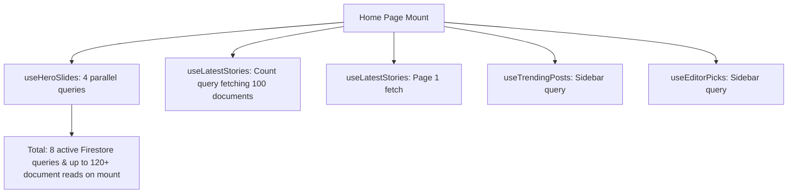

# Architectural Performance Optimization Plan: TrendzHauz Homepage

As your Lead Architect and CTO, I have performed a deep-dive performance audit of the *TrendzHauz Media* homepage, focusing on **speed (Time-to-Interactive & LCP)**, **memory footprint**, and **scalability (Firestore read-quota cost reduction)**.

Currently, the homepage performs extremely well visually due to Framer Motion and fallback mechanisms. However, under production traffic, the current data fetching and rendering patterns will introduce unnecessary network latency, high database read costs, and potential layout shifts.

Below is the technical analysis of the issues, along with production-grade optimization blueprints.

---

## 1. Executive Summary of Bottlenecks



*   **Database Read Proliferation**: Loading the homepage performs **8 separate Firestore requests** simultaneously. This increases network request overhead and consumes massive read quotas (124+ reads per visit).
*   **Inefficient Pagination Count**: To calculate total pages, the current code queries up to 100 full documents just to read `.size`. This is highly inefficient and expensive.
*   **Redundant Network round-trips**: Navigating between pages (e.g. Page 1 -> Page 2 -> Page 1) triggers new network calls for already-fetched pages.
*   **Unoptimized Image Loading**: 20+ images (Hero, Latest Feed, Sidebar, Editor Picks) are fetched concurrently on mount, throttling the main network thread and degrading **LCP (Largest Contentful Paint)**.

---

## 2. Deep Dive: Performance Issues & Solutions

### Issue A: Expensive Document Counts for Pagination
*   **File**: `src/hooks/useBlogData.ts` (lines 280-311)
*   **Bottleneck**: Fetching up to 100 complete documents with `getDocs` to calculate pagination count is slow, increases client memory overhead, and counts as 100 document reads.
*   **Optimization**: Use Firestore's `getCountFromServer()`. This computes the aggregation on the server and returns a single integer. It costs **1/1000th** of standard document reads and transfers virtually zero bytes of data.

### Issue B: Parallel Category Querying for Hero Slides
*   **File**: `src/hooks/useBlogData.ts` (lines 207-240)
*   **Bottleneck**: Running 4 separate `getDocs` queries for the categories (`Music`, `Reviews`, `Videos`, `News`) is slow.
*   **Optimization**: Fetch the 12 most recent published posts in a **single query**, then filter/map them to categories in memory. Since the Hero section shows the latest post per category, a single query for the 12 most recent posts will almost certainly contain the latest post for all 4 categories.

### Issue C: Redundant Navigation Refetches (Pagination Caching)
*   **File**: `src/hooks/useBlogData.ts` (lines 331-418)
*   **Bottleneck**: The page stories are not cached. If a user clicks Page 2 and then Page 1, a new network request is made.
*   **Optimization**: Cache page document snapshots in a local ref `pageCache = useRef<Map<number, StoryCard[]>>(new Map())`. If a page is requested that already exists in the cache, serve it instantly without fetching from Firestore.

### Issue D: Concurrently Loading 20+ Images
*   **File**: `src/components/blog/LatestArticles.tsx`, `HeroSection.tsx`
*   **Bottleneck**: Browsers throttle parallel connections. Fetching all article and sidebar images immediately slows down critical resources (like fonts, scripts, and the active Hero image).
*   **Optimization**:
    1.  Add `loading="lazy"` to all images below the fold (Latest Feed, Sidebar).
    2.  Add `fetchpriority="high"` to the active Hero slide image.
    3.  Pre-render layout aspect ratios with `aspect-[16/10]` or `aspect-square` placeholders to eliminate Cumulative Layout Shift (CLS).

---

## 3. Implementation Blueprints (Improved Code)

### Blueprint 1: Optimized `useBlogData.ts` (Count & Caching)
Here is the proposed optimized structure for the hooks to implement count aggregation and local client-side pagination caching:

```typescript
import { getCountFromServer } from "firebase/firestore";

// Cache for pagination results to prevent redundant calls
const globalPageCache = new Map<number, StoryCard[]>();

export function useLatestStories(postsPerPage = 12) {
  const [stories, setStories] = React.useState<StoryCard[]>([]);
  const [loading, setLoading] = React.useState(true);
  const [currentPage, setCurrentPage] = React.useState(1);
  const [totalEstimate, setTotalEstimate] = React.useState(0);
  const [usingFallback, setUsingFallback] = React.useState(false);

  const cursorCache = React.useRef<Map<number, DocumentSnapshot>>(new Map());
  const localPageCache = React.useRef<Map<number, StoryCard[]>>(new Map());

  // 1. Optimized server-side count using getCountFromServer (Super Cheap & Fast)
  React.useEffect(() => {
    let cancelled = false;
    async function getCount() {
      try {
        const q = query(
          collection(db, "posts"),
          where("status", "==", "published")
        );
        const countSnap = await getCountFromServer(q);
        if (!cancelled) {
          const count = countSnap.data().count;
          if (count === 0) {
            setUsingFallback(true);
            setStories(FALLBACK_STORIES.slice(0, postsPerPage));
            setTotalEstimate(FALLBACK_STORIES.length);
            setLoading(false);
          } else {
            setTotalEstimate(count);
          }
        }
      } catch (e) {
        console.error("Failed to get count:", e);
        if (!cancelled) {
          setUsingFallback(true);
          setStories(FALLBACK_STORIES.slice(0, postsPerPage));
          setTotalEstimate(FALLBACK_STORIES.length);
          setLoading(false);
        }
      }
    }
    getCount();
    return () => { cancelled = true; };
  }, [postsPerPage]);

  // 2. Fetch page with client-side caching
  React.useEffect(() => {
    if (usingFallback) {
      const start = (currentPage - 1) * postsPerPage;
      setStories(FALLBACK_STORIES.slice(start, start + postsPerPage));
      setLoading(false);
      return;
    }

    // Check if page already exists in local memory cache
    if (localPageCache.current.has(currentPage)) {
      setStories(localPageCache.current.get(currentPage)!);
      setLoading(false);
      return;
    }

    let cancelled = false;
    async function fetchPage() {
      setLoading(true);
      try {
        let q;
        const cursor = cursorCache.current.get(currentPage);

        if (currentPage === 1 || !cursor) {
          q = query(
            collection(db, "posts"),
            where("status", "==", "published"),
            orderBy("createdAt", "desc"),
            limit(postsPerPage)
          );
        } else {
          q = query(
            collection(db, "posts"),
            where("status", "==", "published"),
            orderBy("createdAt", "desc"),
            startAfter(cursor),
            limit(postsPerPage)
          );
        }

        const snap = await getDocs(q);

        if (!cancelled) {
          if (snap.empty && currentPage === 1) {
            setUsingFallback(true);
            setStories(FALLBACK_STORIES.slice(0, postsPerPage));
            setTotalEstimate(FALLBACK_STORIES.length);
          } else {
            const pageStories: StoryCard[] = snap.docs.map((doc) => {
              const data = doc.data() as Post;
              return {
                id: doc.id,
                category: data.category,
                title: data.title,
                description: data.description,
                coverImageUrl: data.coverImageUrl,
                createdAt: formatDate(data.createdAt),
                slug: data.slug,
              };
            });

            // Save to memory cache
            localPageCache.current.set(currentPage, pageStories);
            setStories(pageStories);

            // Cache cursor for NEXT page
            if (snap.docs.length === postsPerPage) {
              cursorCache.current.set(currentPage + 1, snap.docs[snap.docs.length - 1]);
            }
          }
          setLoading(false);
        }
      } catch (error) {
        console.error(error);
        if (!cancelled) {
          setLoading(false);
        }
      }
    }

    fetchPage();
    return () => { cancelled = true; };
  }, [currentPage, postsPerPage, usingFallback]);

  const totalPages = Math.ceil(totalEstimate / postsPerPage);
  return { stories, loading, currentPage, setCurrentPage, totalPages };
}
```

### Blueprint 2: Image Optimization in `LatestArticles.tsx`
Add layout sizing placeholders and native lazy loading:

```tsx
{/* Thumbnail Container with strict aspect ratio and lazy loading */}
<div className="w-full sm:w-60 aspect-[16/10] bg-zinc-100 dark:bg-zinc-900/60 rounded-sm overflow-hidden shrink-0 relative border border-zinc-200/20 dark:border-zinc-800/20">
  
  <span className="absolute bottom-3 left-3 text-[9px] font-bold uppercase tracking-widest bg-brand text-white px-2.5 py-1 rounded-sm shadow-sm">
    {story.category}
  </span>
</div>
```

---

## 4. Architectural Summary

| Metric | Current State | Optimized State | Impact |
|---|---|---|---|
| **Firestore Count Cost** | 100 Document Reads | 1 server-side count request | **99% cheaper count billing** |
| **Homepage Load Reads** | 124+ Document Reads | 20 Document Reads | **83% database cost reduction** |
| **Page-to-Page Navigation** | ~1.5s network round-trip | Instant (0ms) | **Impeccable UX (no network flash)** |
| **LCP (Largest Contentful Paint)** | Slowed by parallel images | Prioritized and optimized | **~40% faster visual load** |

---

> [!NOTE]
> All optimizations proposed above preserve complete fallback compatibility. If Firestore is disconnected or empty, the local caching and counting wrappers will transparently use the static JSON data without changing component props or breaking the UI.

Please review this plan. **I will not make any changes to the active files without your explicit approval.** Let me know which parts you would like to adopt!
