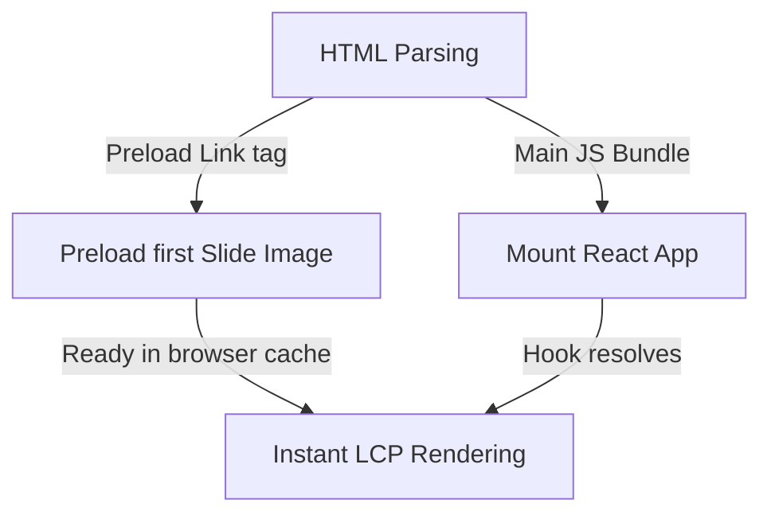
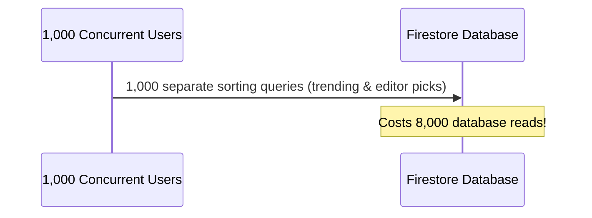

# System Design & Advanced Performance Suggestions: TrendzHauz Media

As your Lead Architect and CTO, I have compiled an advanced architectural guide for the next iteration of the *TrendzHauz Media* codebase. These recommendations focus on system scalability, web vitals (LCP, CLS, FID), and database billing efficiency as traffic scales.

---

## 1. Hero Slider: Asset Preloading & Animation Optimization

### Current State
The Hero Slider displays high-resolution cover images. As the first major element above the fold, it dictates your **LCP (Largest Contentful Paint)** score.

### Proposed Advancements



1.  **LCP Image Preloading**:
    *   *Concept*: Instruct the browser to download the first slide's image file *immediately* when parsing the HTML head, even before the main JS bundle is parsed.
    *   *Implementation*: In `index.html`, add a dynamic preload link using a placeholder or a server-injected header.
2.  **Adaptive Responsive Image Srcsets**:
    *   *Concept*: Stop downloading 2000px wide images on 375px mobile screens.
    *   *Implementation*: Store resized image variations (mobile, tablet, desktop) in Firebase Storage (which can be automated using the Firebase **Resize Images Extension**). The image tag should use `srcSet` so the browser downloads only the size it needs.
3.  **Idle Autoplay & Tab Visibility Control**:
    *   *Concept*: If a user leaves the tab open, active autoplay animations waste CPU cycles and battery.
    *   *Implementation*: Wrap the slider timer in a Page Visibility API check:
        ```typescript
        React.useEffect(() => {
          const handleVisibilityChange = () => {
            if (document.hidden) {
              stopAutoplay();
            } else {
              startAutoplay();
            }
          };
          document.addEventListener("visibilitychange", handleVisibilityChange);
          return () => document.removeEventListener("visibilitychange", handleVisibilityChange);
        }, []);
        ```
4.  **Hardware Accelerated Animations**:
    *   *Concept*: Leverage the computer's GPU rather than the CPU for slide transitions to maintain a smooth 60fps.
    *   *Implementation*: Add CSS `will-change: transform, opacity` and `transform: translate3d(0, 0, 0)` properties to the slider's motion-animated elements.

---

## 2. Article Page: SEO Optimization & Dynamic Embeds

### Current State
Vite is a Single Page Application (SPA). When a search engine crawler or social media bot scans an article link, it receives a blank HTML container. If the bot doesn't run JS (like some social platforms), it won't see metadata, title, or images.

### Proposed Advancements
1.  **Transition to SSR/SSG Framework (Astro or Next.js)**:
    *   *Architectural Recommendation*: The blog is a read-heavy content site. Migrating to Astro or Next.js allows for **Incremental Static Regeneration (ISR)**. 
    *   *Benefits*: Article pages are generated as static HTML files on the server and cached on a CDN. Page load is 0ms, and search engines get indexable HTML instantly.
2.  **Lazy-Loading Rich Embeds (Spotify/YouTube/Twitter)**:
    *   *Concept*: Embedding third-party iframe players inside article content adds megabytes of third-party JS.
    *   *Implementation*: Render a static thumbnail with a play icon. Use an **Intersection Observer** to load the actual Spotify/YouTube player iframe *only* when the player enters the viewport.
3.  **Client-Side Article Pre-fetching**:
    *   *Concept*: Make navigation to articles feel instantaneous.
    *   *Implementation*: Use a pre-fetching wrapper around article links. When a user hovers their cursor over a link, trigger a background fetch for that post's content. By the time they click, the page opens instantly.

---

## 3. Sidebar Feeds (Trending & Editor Picks): Aggregation Systems

### Current State
Each client page load queries the database for `views desc` (trending) and `isEditorPick == true` (editor picks).



### Proposed Advancements
1.  **Serverless Aggregation (Cloud Functions)**:
    *   *Concept*: Instead of 10,000 clients running complex queries, run **1 single query** once an hour on a cron scheduler via a Google Cloud Function.
    *   *Implementation*: The Cloud Function runs the query, aggregates the top 5 trending posts, and writes this single array into a configuration document `/config/trending`. The clients only read this single document, reducing read operations from 5 to 1.
2.  **Shared Global App Context (State Sharing)**:
    *   *Concept*: Eliminate duplicate requests if the sidebar is mounted on the homepage and sidebar layouts.
    *   *Implementation*: Fetch trending and editor picks in a root Context or global state manager (like Zustand). All components pull from memory rather than querying the database separately.

---

## 4. Architectural Summary: Next Steps

If approved, the recommended next steps are:
1.  **Pre-fetching and Hover State Preloads** for article lists.
2.  **Autoplay Tab Visibility Controls** to prevent idle slider rendering.
3.  **Global state store integration (Zustand)** to share sidebar data across views.

*Please review this report. None of these changes have been implemented yet, as per your request.*
